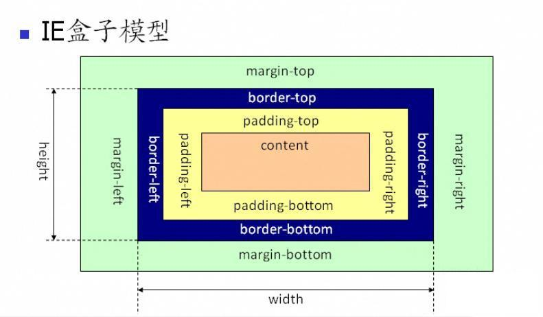

## 盒模型总结

### W3C标准的盒模型：

外盒尺寸计算（元素空间尺寸）

	element 空间高度 = 内容高度 + 内距 + 边框 + 外距
	element 空间宽度 = 内容宽度 + 内距 + 边框 + 外距

内盒尺寸计算（元素大小）

	element 高度 = 内容高度 + 内距 + 边框 （height 为内容高度）
	element 宽度 = 内容宽度 + 内距 + 边框 （width 为内容高度）

### IE传统下盒模型（IE6一下，不包含IE6及QuirksMode 下IE 5.5+）

外盒尺寸计算（元素空间尺寸）
	
	element 空间高度 = 内容高度 + 外距（height 包含了元素内容高度、边框、内距）
	element 空间宽度 = 内容宽度 + 外距（width 包含了元素内容宽度、边框、内距）
	
内盒尺寸计算（元素大小）

	element 高度 = 内容高度(height 包含了元素内容高度、边框、内距）
	element 宽度 = 内容宽度(width 包含了元素内容宽度、边框、内距）
	

**box-sizing语法**

* 默认值：content-box  
* border-box
* inherit

浏览器兼容：

| 浏览器     | IE     | Friefox   | Chrome  | Opera  |Safari  |
| :-------: |:------:|:---------:|:-------:|:------:|:------:|
| box-sizing| 8 + √  | 1.5 + √   |1.0 + √  | 9.0 + √| 3.1 + √|

## display:flex;总结

