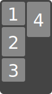
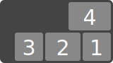
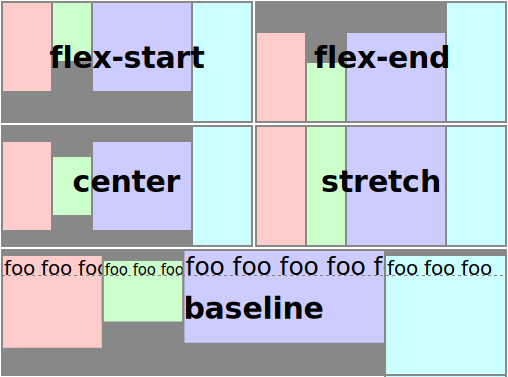
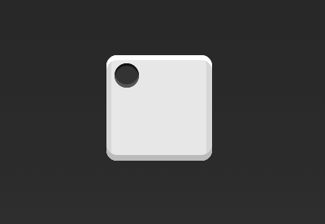
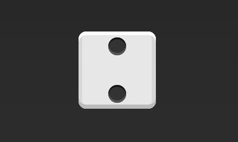
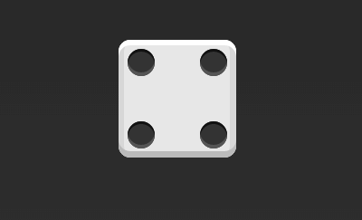
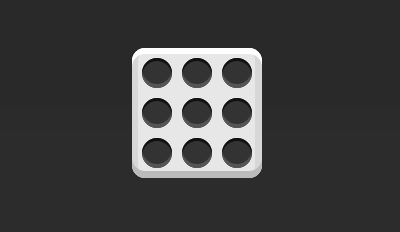

#Flex 布局语法

## 什么是flex布局

Flex是Flexible Box的缩写，意为"弹性布局"，用来为盒状模型提供最大的灵活性。

任何一个容器都可以指定为Flex布局。

	.box {
		dispaly:flex;
	}
	
行内元素也可以使用flex布局

	.box {
		display:inline-flex;
	}

注意，设为Flex布局以后，子元素的`float`、`clear`和`vertical-align`属性将失效。

## flex的基本概念

采用Flex布局的元素，称之为Flex 容器（flex container），它的所有子元素自动成为容器成员，称之为Flex项目（flex item）。

容器默认存在两根轴：水平的主轴（main axis）和垂直的交叉轴（cross axis）。主轴的开始位置（与边框的交叉点）叫做main start，结束位置叫做main end；交叉的开始位置叫做cross start，结束位置叫做cross end。

项目默认沿主轴排列。单个项目占据的主轴空间叫做main size，占据的交叉轴空间叫做cross size。

## Flex容器的属性

以下6个属性设置在容器上：

	* flex-direction
	* flex-wrap
	* flex-flow
	* justify-content
	* align-items
	* align-content

* flex-direction 属性

`flex-direction` 属性决定主轴的方向（即flex items的排列方向）

	.box {
		flex-direction:row | row-reverse | column | column-reverse;
	}
		

其值有4种，分别是：
	
	1. row (default):主轴为水平方向，起点在左端。
	2. row-reverse:主轴为水平方向，起点为右端。
	3. column:主轴为垂直方向，起点在上沿。
	4. column-reverse:主轴为垂直方向，起点在下沿。
	
* flex-wrap 属性

默认情况下，项目都排在一条线（即轴线）上。`flex-wrap`属性定义，如果一条轴线排不下，如何换行。

	.box {
 		 flex-wrap: nowrap | wrap | wrap-reverse;
	}
其值有3种，分别是：

	1. nowrap(default): 不换行(图一)。
	2. wrap: 换行，第一行在上方（图二）。
	3. wrap-reverse: 换行，第一行在下方（图三）。

 (图一)

（图二）

（图三）

* flex-flow 属性

`flex-flow` 属性是`flex-direction`和`flex-wrap` 属性的简写形式，默认值为：`row nowrap`。

	.box {
		flex-flow: <flex-direction> || <flex-wrap>;
	}
	
例：
	
	.box { flex-flow: row; }
	

	
	.box { flex-flow: column wrap; }
	

	.box { flex-flow: row-reverse wrap-reverse; }
	

	
* justify-content 属性 

`justify-content` 属性定义flex项目在主轴上的对齐方式。

	.box {
		justify-content: flex-start | flex-end | center | space-between | space-around;
	}

其值有5种，分别是：

	1. flex-start(default): 左对齐
	2. flex-end: 右对齐
	3. center: 居中
	4. space-between: 两端对齐，flex项目之间的间隔相等
	5. space-around: 每个flex项目两侧的间隔相等。所以，项目之间的间隔比项目与边框的间隔大一倍

* align-items 属性

`align-items` 属性定义项目在交叉轴上如何对齐。

	.box {
		align-items: stretch | flex-start | flex-end | center | baseline;
	}

其值有5种，分别是：（以下假设交叉轴从上到下）

	1. stretch(default): 如果flex 项目未设置高度或者是设为auto,将沾满整个容器的高度
	2. flex-start: 交叉轴的起点对齐
	3. flex-end: 交叉轴的终点对齐
	4. center: 交叉轴的中点对齐
	5. baseline: flex项目的第一行文字的基线对齐

* align-content 属性

`align-content` 属性定义了多跟轴线的对齐方式。如果flex项目只有一根轴线，该属性不起作用。

	.box {
  		align-content: flex-start | flex-end | center | space-between | space-around | stretch;
	}
	
 

其值有6种，分别是：

	1. stretch(default): 轴线占满整个交叉轴
	2. flex-start: 与交叉轴的起点对齐
	3. flex-end: 与交叉轴终点对齐
	4. center: 与交叉轴中点对齐
	5. space-between: 与交叉轴两端对齐，轴线之间的间隔平均分布
	6. space-around: 每根轴线两侧的间隔都相等。所以，轴线之间的间隔比轴线与边框的间隔大一倍

## flex 项目的属性

以下6个属性设置在flex项目上：

	1. order
	2. flex-grow
	3. flex-shrink
	4. flex-basis
	5. flex
	6. align-self
	
* order 属性

`order` 属性定义flex项目的排列顺序。数值越小排列越靠前，默认为0

	.item {
		order: <integer>;
	}

* flex-grow 属性

`flex-grow` 属性定义flex项目的扩展比率，默认为0，即如果存在剩余空间，也不放大

	.item {
		flex-grow: <number>; /* default: 0 */
	}
	

如果所有的flex项目的`flex-grow` 属性都是1，则它们将等分剩余的空间（如果存在剩余空间）。如果一个flex项目的`flex-grow` 属性为2，其他flex项目都为1，则前者占据的剩余空间将比其他的项多一倍

* flex-shrink 属性

`flex-shrink` 属性定义flex项目的收缩比率，默认值为1，即如果空间不足，该项目将缩小

	.item {
		flex-shrink: <number>;/* default:1 */
	}

如果所有的项目的`flex-shrink` 属性都是1，当空间不足时，都将等比缩小。如果一个项目的`flex-shrink` 属性为0，其他的项目都为1，则空间不足时，前者将不缩小。负值对该属性无效。

* flex-basis 属性

`flex-basis` 属性定义在分配多余空间之前，项目占据的主轴空间（main size）即伸缩基准值。浏览器根据这个属性计算主轴是否有多余空间。默认值为auto，即项目本来大小

	.item {
		flex-basis: <length> | auto; /* default : auto */
	}
	
它可以设置为跟`width`或`height`属性一致的值，则项目将占据固定空间

* flex 属性

`flex` 属性是`flex-grow`、`flex-shrink`、`flex-basis` 的简写，默认值为 0 1 auto。后两个属性可选。

	.item {
  		flex: none | [ <'flex-grow'> || <'flex-shrink'>? || <'flex-basis'> ]
	}
	
该属性有两个快捷值：auto （1 1 auto）和 none （0 0 auto）；

	flex: 1,    则其计算值为 flex: 1 1 0%；
	flex: auto, 则其计算值为 flex: 1 1 auto；
	flex: none, 则其计算值为 flex: 0 0 auto；

**建议优先使用这个属性，而不是单独写三个分离的属性，因为浏览器会推算相关值**

* align-self 属性

`align-self` 属性允许单个项目由于其他项目不一样的对齐方式，可以覆盖`align-items` 属性，默认值为auto，表示继承父元素的`align-items` 属性，如果没有父元素，则等同于`stretch`

	.item {
		align-self: auto | flex-start | flex-end | center | baseline  | stretch;
	}
	

其值有6种，除了auto之外，其他都与`align-items` 属性完全一致。

## flex 布局实例 （骰子的布局）

骰子的一面最多可以放置9个点。

下面就来看看flex如何来实现从1-9个点的布局。 [jsfiddle demos](https://jsfiddle.net/maxsmu/3mj14ds5/)

如果不见说明，本节的HTML模板都一律如下。

	

		
	

	
上面的代码中`div`元素是Flex容器即骰子的一个面，`span`元素是flex 项目即代表一个点。如果多个项目就要添加多个span元素，以此类推。

1.单项目

首先，只有左上角一个点的情况。Flex布局默认情况就是首行左对齐，所以一行代码搞定。

	.box {
		display: flex;
	}
	

设置对齐方式，就能实现居中对齐还是右对齐。

	.box {
		display:flex;
		justify-content:center;
	}
	

	.box {
		display:flex;
		justify-content:fles-end;
	}
	

	.box {
		display:flex;
		justify-content:center;
	}

设置交叉轴对齐方式，可以垂直移动主轴。

	.box {
		display:flex;
		align-items:center;
	}
	

	.box {
		display:flex;
		justify-content: center;
		align-items: center;
	}

2.双项目

	.box {
		display:flex;
		justify-content: space-between;
	}
	

	.box {
		display: flex;
		flex-direction: column;
		justify-content: space-between;
	}
	

	.box {
		display: flex;
		flex-direction: column;
		justify-content: space-between;
		flex-items: center;
	}
	

	.box {
		display: flex;
	}
	.item:nth-child(2){
		flex-self: center;
	}
	

	.box {
		dispaly: flex;
		justify-content: space-between;
	}
	.item:nth-child(2){
		flex-self: flex-end;
	}
	

3.三项目

	.box {
		display: flex;
	}
	.item:nth-child(2){
		flex-self: center;
	}
	.item:nth-child(3){
		flex-self: flex-end;
	}

4.四项目

	.box {
		display: flex;
		flex-wrap: wrap;
		justify-content: flex-end;
		align-content: space-between;
	}
	

HTML 代码：

	

		

			
			
		

		

			
			
		

	

	
CSS 代码

	.box {
		dispaly: flex;
		flex-wrap: wrap;
		justify-content: space-wetween;
	}
	.column {
		flex-basis: 100%;
		display: flex;
		justify-content: space-between;
	}
	

5.六项目

HTML 代码

	

		

			
			
		

		

			
			
		

		

			
			
		

	

CSS 代码

	.box {
		display: flex;
		flex-wrap: wrap;
		justify-content: space-between;
		flex-direction: column;
	}
	

6.五项目

HTML 代码

	

		

			
			
		

		

			
		

		

			
			
		

	

CSS 代码

	.box {
		display: flex;
		justify-content: space-between;
	}
	.column {
    	display: flex;
    	flex-direction: column;
    	justify-content: space-between;
	}
	.column:nth-of-type(2) {
		justify-content: center;
	}

7.九项目

	.box {
	  display: flex;
	  flex-wrap: wrap;
	}

## 网格布局

最简单的网格布局，就是平均分布。在容器里面平均分配空间，跟上面的骰子布局很像，但是需要设置项目的自动缩放。

HTML 代码

	

		
...

		
...

		
...

	

	
CSS 代码

	.grid {
		display: flex;
	}
	.grid-cell {
		flex: 1;
	}
	

## 百分比布局

某个网格的宽度为固定的百分比，其余网格平均分配剩余空间。

HTML 代码

	

		
...

		
...

		
...

	

	
CSS 代码

	.grid {
		display: flex;
	}
	.grid-cell {
		flex:1;
	}
	.grid-cell.u-full {
		flex:0 0 100%;
	}
	.grid-cell.u-1of2 {
		flex:0 0 50%;
	}
	.grid-cell.u-1of3 {
		flex:0 0 33.3333%;
	}
	.grid-cell.u-1of4 {
		flex:0 0 25%;
	}
	
## 三圣杯布局

圣杯布局（Holy Grail Layout）指的是一种最常见的网站布局。页面从上到下，分成三个部分：头部（header），躯干（body），尾部（footer）。其中躯干又水平分成三栏，从左到右为：导航、主栏、副栏。

HTML 代码
	
	<body class="holy-grail">
		<header>...</header>
		

			<main class="holy-grail-content">...</main>
			<nav class="holy-grail-nav">...</nav>
			<aside class="holy-grail-aside">...</aside>
		

		<footer>...</footer>
	</body>
	
CSS 代码

	.holy-grail {
		display: flex;
		min-height: 100vh;
		flex-firection: column;
	}
	header,footer {
		flex: 1;
	}
	.holy-grail-body {
		display: flex;
		flex: 1;
	}
	.holy-grail-conetent {
		flex: 1;
	}
	.holy-grail-nav, holy-grail-aside {
		/* 两个边栏的宽度设为12em */
		flex: 0 0 12em;
	}
	.holy-grail-nav {
		/* 导航放在最左边 */
		order: -1;
	}
	
	/* 如果是小屏幕，躯干的三栏自动变为垂直叠加 */
	@media (max-width: 768px) {
		.holy-grail-body {
			flex-direction: column;
			flex: 1;
		}
		.holy-grail-nav,
		.holy-grail-aside, 
		.holy-grail-content {
			flex: auto;
		}
	}
	
	
1. 基本网格布局
2. 百分比
3. 三圣杯
4. 表单
5. 悬挂
6. 